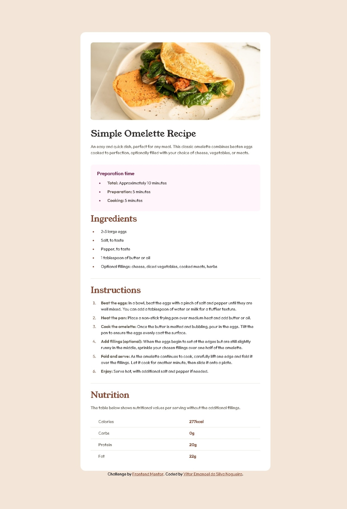

# Frontend Mentor - Recipe page solution

This is a solution to the [Recipe page challenge on Frontend Mentor](https://www.frontendmentor.io/challenges/recipe-page-KiTsR8QQKm). Frontend Mentor challenges help you improve your coding skills by building realistic projects. 

## Table of contents

- [Overview](#overview)
  - [The challenge](#the-challenge)
  - [Screenshot](#screenshot)
  - [Links](#links)
- [My process](#my-process)
  - [Built with](#built-with)
  - [What I learned](#what-i-learned)
- [Author](#author)


## Overview
  - Started using the semantic HTML5 markup, then started styling the mobile version of the page with CSS and then used media query for the desktop version.
  
### Screenshot



### Links

- Solution URL: [https://github.com/VitorEmanoelNogueira/recipe-page-main](https://github.com/VitorEmanoelNogueira/recipe-page-main)
- Live Site URL: [https://vitoremanoelnogueira.github.io/recipe-page-main/index](https://vitoremanoelnogueira.github.io/recipe-page-main/index)

## My process

### Built with

- Semantic HTML5 markup
- CSS custom properties
- Flexbox
- CSS Grid
- Mobile-first workflow

### What I learned

- Learned how to use the CSS pseudo-class :not().


To see how you can add code snippets, see below:

```css
section:not(:first-of-type, :last-of-type){
    border-bottom: 1px solid var(--c7);
}

tr:not(:last-child) {
    border-bottom: 1px solid var(--c7);
}
```

## Author

- Frontend Mentor - [@VitorEmanoelNogueira](https://www.frontendmentor.io/profile/VitorEmanoelNogueira)


